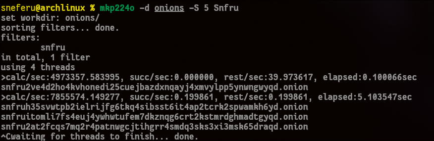
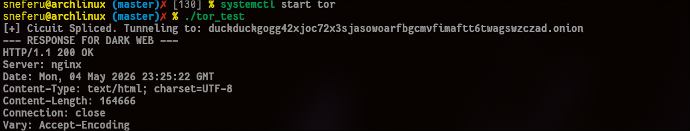



## 🛠️ The Brute Force Setup: Mining Identity
> 
> **Unlike the clearnet, where you "rent" a domain from a central registrar like GoDaddy or Namecheap, an onion address is mined. It is a cryptographic discovery. To own an address that starts with a specific string, you have to iterate through billions of random key pairs until the math aligns. It is a raw expenditure of CPU cycles to prove ownership.**

---

## The URL is the Key: Ed25519 Architecture
In Tor v3, your `.onion` address isn't just a label—it is a **Self-Authenticating Cryptographic Identifier**. It is derived directly from an **Ed25519 Public Key**.

A 56-character v3 address is a Base32-encoded string consisting of:
1. **The Public Key:** 32 bytes.
2. **The Checksum:** 2 bytes.
3. **The Version Byte:** 1 byte (`0x03`).

### The Hashing Logic
The checksum is calculated as follows:
$$
\text{Checksum} = \text{SHA3-256}( \text{".onion checksum"} \parallel \text{PublicKey} \parallel \text{Version} )
$$

By smashing these together and encoding them in **Base32**, we get the final URL. 


---

## The Probability of Vanity
As an operator, you don't want a random string like `vww6ybal...`. You want a brand. But because the address is a hash, you have to play the **Probability Game**.

The average number of attempts $N$ required to find an $n$-character prefix in Base32 is:
$$N = 32^n$$

For a 7-character prefix like `sneferu`:
$$32^7 = 34,359,738,368 \text{ attempts}$$

On a modern CPU (like your Arch machine), this might take 1–3 hours. For a 12-character prefix, you’d need a server farm for several years. This is why you see "official" onion sites with only the first few letters being readable.

---

## 💻 C++ Operator Logic
```C++{
#include<iostream>
#include<cstring>
#include<arpa/inet.h>
#include<sys/socket.h>
#include<string>
#include<vector>
#include<unistd.h>

class TorOperator { 

public:
	// Connects throught the local Tor proxy (default 9050 or 9150)
	static int Connect(const std::string& onion_url, int port){

		int sock = socket(AF_INET, SOCK_STREAM, 0);
		if(sock < 1) return -1;

		//1. Target Proxy
		sockaddr_in proxy;
		proxy.sin_family = AF_INET;
		proxy.sin_port = htons(9050); //Standard Tor SOCKS Port
					      
		//inet_addr is ancient and deprecated. It doesn't handle errors well (it returns -1 on failure, but 255.255.255.255 is also -1).
		//inet_pton stands for "Presentation to Network." It’s safer, more modern, and it supports IPv6 if you ever need it (AF_INET6). It’s the "Pro" way to write networking code in 2026.
		inet_pton(AF_INET, "127.0.0.1", &proxy.sin_addr);

		if(connect(sock, (struct sockaddr*)&proxy, sizeof(proxy)) < 0 ){
			close(sock); 
			return -1;
		}

		//2. SOCKS5 Greeting
		// [ Version 5, 1 Method, No Auth ]
		uint8_t greeting[] = {0x05, 0x01, 0x00}; 
		send(sock, greeting, 3, 0);

		uint8_t response[2];
		recv(sock, response, 2, 0);
		if (response[1] != 0x00) return -1; //Auth rejected

		// The Connection Request 
		// [ Ver 5, CMD Connect, Reserved, ATYP Domain ]
		std::vector<uint8_t> request = {0x05, 0x01, 0x00, 0x03};
		request.push_back(static_cast<uint8_t>(onion_url.length()));
		request.insert(request.end(), onion_url.begin(), onion_url.end());

		uint16_t p = htons(port);
		uint8_t* port_bytes = (uint8_t*) &p;
		request.push_back(port_bytes[0]);
		request.push_back(port_bytes[1]);

		send(sock, request.data(),request.size(), 0);

		//4. Final Proxy Response
		uint8_t final_res[10];
		recv(sock, final_res, 10, 0);

		if(final_res[1] == 0x00){

			std::cout << "[+] Cicuit Spliced. Tunneling to: " << onion_url << std::endl;

			const char* http_get = "GET / HTTP/1.1\r\nHost: your-onion-site.onion\r\nConnection: close\r\n\r\n";
			send(sock, http_get, strlen(http_get), 0);

			return sock; // Socket is now transparently connected to the onion 
		}

		close(sock);
		return -1;

	}

};

int main(){

	int sock = TorOperator::Connect("duckduckgogg42xjoc72x3sjasowoarfbgcmvfimaftt6twagswzczad.onion", 80);

	if(sock > 0){

		// 2. Prepare the HTTP GET request

		std::string request = 
        	"GET / HTTP/1.1\r\n"
        	"Host: duckduckgogg42xjoc72x3sjasowoarfbgcmvfimaftt6twagswzczad.onion\r\n"
        	"User-Agent: Operator-Researcher/1.0\r\n"
        	"Connection: close\r\n\r\n";
	
		// Send the request
		send(sock, request.c_str(), request.length(), 0);


		// 4. Receive the response
		char buffer[4096];
		int bytes_received = recv(sock, buffer, sizeof(buffer) - 1, 0);

		if(bytes_received > 0){

			buffer[bytes_received] = '\0';
			std::cout << "--- RESPONSE FOR DARK WEB ---" << std::endl;
			std::cout << buffer << std::endl;
		}

		close(sock);

	}else{
		std::cerr << "[-] Failed to splice circuit. Is tor.service running?" << std::endl;
	}

	return 0;

}
```
## Result
**The Result
Running this on my Arch rig produces the following output. Notice the 200 OK—this is the sound of a successful handshake across the shadow network.**



    
    ```text
    [+] Circuit Spliced. Tunneling to: duckduckgogg42xjoc72x3sjasowoarfbgcmvfimaftt6twagswzczad.onion
	--- RESPONSE FOR DARK WEB ---
	HTTP/1.1 200 OK
	Server: nginx
	Date: Mon, 04 May 2026 23:25:22 GMT
	Content-Type: text/html; charset=UTF-8
	Content-Length: 164666
	Connection: close
	Vary: Accept-Encoding
	ETag: "69f8ff05-2833a"
	Permissions-Policy: interest-cohort=()
	Content-Security-Policy: default-src 'none' ; connect-src  https://duck.ai https://*.duck.ai https://duckduckgo.com https://*.duckduckgo.com https://duckduckgogg42xjoc72x3sjasowoarfbgcmvfimaftt6twagswzczad.onion/ https://spreadprivacy.com ; manifest-src  https://duck.ai https://*.duck.ai https://duckduckgo.com https://*.duckduckgo.com https://duckduckgogg42xjoc72x3sjasowoarfbgcmvfimaftt6twagswzczad.onion/ https://spreadprivacy.com ; media-src  https://duck.ai https://*.duck.ai https://duckduckgo.com https://*.duckduckgo.com https://duckduckgogg42xjoc72x3sjasowoarfbgcmvfimaftt6twagswzczad.onion/ https://spreadprivacy.com ; script-src blob:  https://duck.ai https://*.duck.ai https://duckduckgo.com https://*.duckduckgo.com https://duckduckgogg42xjoc72x3sjasowoarfbgcmvfimaftt6twagswzczad.onion/ https://spreadprivacy.com 'unsafe-inline' 'unsafe-eval' ; font-src data:  https://duck.ai https://*.duck.ai https://duckduckgo.com https://*.duckduckgo.com https://duckduckgogg42xjoc72x3sjasowoarfbgcmvfimaftt6twagswzczad.onion/ https://spreadprivacy.com ; img-src data:  https://duck.ai https://*.duck.ai https://duckduckgo.com https://*.duckduckgo.com https://duckduckgogg42xjoc72x3sjasowoarfbgcmvfimaftt6twagswzczad.onion/ https://spreadprivacy.com ; style-src  https://duck.ai https://*.duck.ai https://duckduckgo.com https://*.duckduckgo.com https://duckduckgogg42xjoc72x3sjasowoarfbgcmvfimaftt6twagswzczad.onion/ https://spreadprivacy.com 'unsafe-inline' ; object-src 'none' ; worker-src blob: ; child-src blob:  https://duck.ai https://*.duck.ai https://duckduckgo.com https://*.duckduckgo.com https://duckduckgogg42xjoc72x3sjasowoarfbgcmvfimaftt6twagswzczad.onion/ https://spreadprivacy.com ; frame-src blob:  https://duck.ai https://*.duck.ai https://duckduckgo.com https://*.duckduckgo.com https://duckduckgogg42xjoc72x3sjasowoarfbgcmvfimaftt6twagswzczad.onion/ https://spreadprivacy.com ; form-action  https://duck.ai https://*.duck.ai https://duckduckgo.com https://*.duckduckgo.com https://duckduckgogg42xjoc72x3sjasowoarfbgcmvfimaftt6twagswzczad.onion/ https://spreadprivacy.com ; frame-ancestors 'self' https://html.duckduckgo.com; base-uri 'self' ; block-all-mixed-content ;
	X-Frame-Options: SAMEORIGIN
	X-XSS-Protection: 1;mode=block
	X-Content-Type-Options: nosniff
	Referrer-Policy: origin
	Expect-CT: max-age=0
	Expires: Mon, 04 May 2026 23:25:21 GMT
	Cache-Control: no-cache
	Accept-Ranges: bytes

	<!DOCTYPE html><html lang="en-US" class=""><head><meta charSet="utf-8" data-next-head=""/><meta name="viewport" content="width=device-width, initial-scale=1, user-scalable=1 , viewport-fit=auto" data-next-head=""/><link rel="preload" href="/static-assets/font/ProximaNova-RegIt-webfont.woff2" as="font" type="font/woff2" crossorigin="anonymous" data-next-head=""/><link rel="preconnect" href="/country.json" data-next-head=""/><link rel="preload" href="/country.json" as="fetch" fetchPriority="high" data-next-head=""/><title data-next-head="">DuckDuckGo - Protection. Privacy. Peace of mind.</title><meta name="description" content="The Internet privacy company that empowers you to seamlessly take control of your personal information online, without any tradeoffs." data-next-head=""/><meta name="twitter:card" content="summary_large_image" data-next-head=""/><meta name="twitter:site" content="@duckduckgo" data-next-head=""/><meta name="twitter:title" content="DuckDuckGo - Protection. Privacy. Peace of mind." data-next-head=""/><meta name="twitter:description" content="The Internet privacy company that empowers you to seamlessly take control of your personal information online, without any tradeoffs." data-next-head=""/><meta name="twitter:image" content="https://duckduckgo.com/assets/logo_social-media.png" data-next-head=""/><meta property="og:url" content="https://duckdu
    ```
    



## Trust without Authorities
The most powerful part of this identity is the lack of a "Middleman." 
* **Clearnet:** You trust a **Certificate Authority (CA)** like DigiCert to verify that `google.com` is really Google.
* **Dark Web:** The browser *verifies the math*. If you have the URL, you have the Public Key. If the server can prove it has the Private Key (via a digital signature during the handshake), it **is** the site. No one can steal or spoof your domain without your private key.

---

## Next in the Series
In the final part, we look at the **Exit Strategy**. Even with perfect math, people get caught. We will dive into **OpSec**, **Traffic Correlation**, and how the 'Shadow' can eventually betray you.
